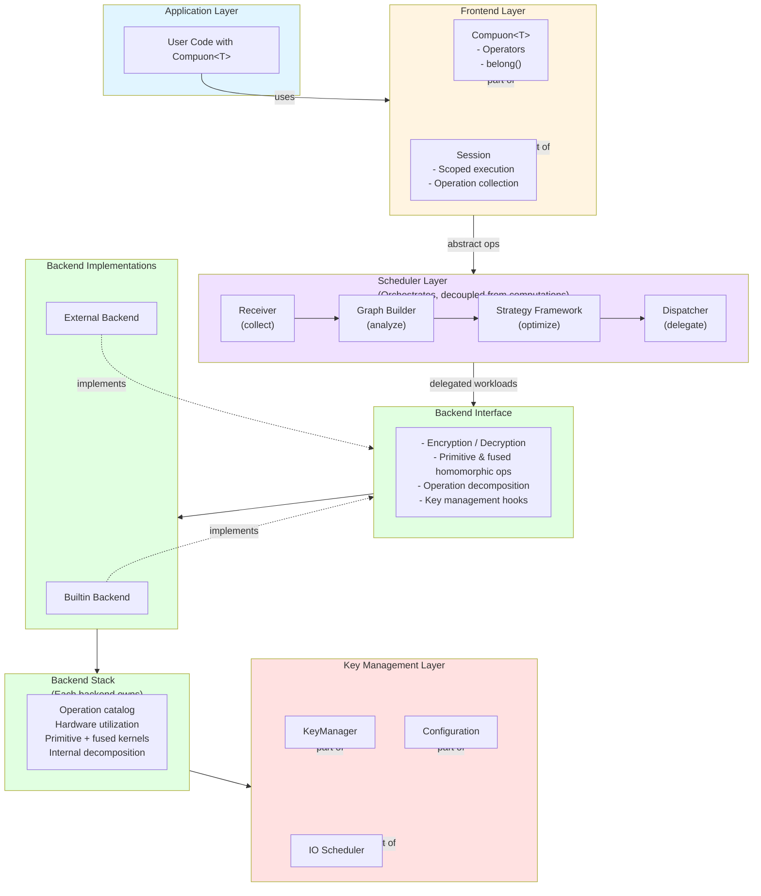

# FHENOMENON: A Catalyst for Enabling Practical Fully Homomorphic Encryption Programming Model
[Convergent Evolution: Why Secure Homomorphic Encryption Will Ressemble High-Performance GPU Computing](https://hackmd.io/f2N90VpeQiKtB4OOTOA-Zw)
> Building these kernels also solves the ecosystem’s chicken-and-egg problem: useful, coarse-grained kernels must come first to create immediate value, attract developers, and enable sustainable growth. **A lightweight orchestration framework can manage this efficiently, where the trusted host performs simple runtime scheduling—dispatching fused kernels when available and falling back to basic ones otherwise.** Since scheduling depends only on the public sequence of API calls, it remains inherently secure.

## Abstract

Fully Homomorphic Encryption (FHE) enables computations on encrypted data without decryption, preserving privacy during processing. However, FHE's complexity and resource-intensive nature have limited its adoption. **Fhenomenon** proposes a C++ library framework that bridges this gap through a flexible, user-friendly interface abstracting FHE complexities while supporting multiple backend libraries and hardware acceleration. This note outlines the architectural vision, design principles, and implementation strategy for **Fhenomenon**, positioning it as a community-driven effort to democratize FHE adoption.

---

## 1. Introduction

Fully Homomorphic Encryption represents a paradigm shift in privacy-preserving computation, enabling third parties to process encrypted data without access to plaintext. Despite its transformative potential, FHE remains largely inaccessible due to:

- **Cryptographic complexity**: Users must understand various FHE schemes, parameter selection, and noise management
- **Performance barriers**: FHE operations are computationally expensive, requiring specialized optimization
- **Library fragmentation**: Multiple FHE libraries exist with incompatible interfaces, making portability difficult
- **Hardware diversity**: Accelerators (GPUs, ASICs, FPGAs) require specialized integration

**Fhenomenon** addresses these challenges through a unified architecture that separates user-facing APIs from cryptographic implementation, enabling:

- **Intuitive programming**: Work with familiar C++ types (`int`, `double`, `std::complex`) through `Compuon<T>` without cryptographic knowledge
- **Backend flexibility**: Support both built-in and external FHE libraries through a common interface
- **Performance optimization**: A scheduler that builds operation graphs, fuses computations, and dispatches to accelerators
- **Extensible framework**: Community-contributed optimization strategies and hardware acceleration modules

This document describes the design **Fhenomenon** should realize through collaborative development.

---

## 2. Design Objectives

The primary objectives guiding **Fhenomenon**'s architecture are:

### 2.1 Ease of Use
- **Cryptography-agnostic APIs**: Users work with standard C++ types and operators, never directly with ciphertexts or keys
- **Intuitive semantics**: `Compuon<T>` behaves like a regular type, with encryption/decryption handled implicitly
- **Minimal configuration**: Scheduler automatically determines FHE parameters based on computation requirements

### 2.2 Flexibility
- **Backend abstraction**: Support multiple FHE libraries (SEAL, HElib, OpenFHE, etc.) through a common interface
- **Plugin architecture**: External libraries loaded dynamically as shared libraries
- **Scheme agnosticism**: Users can switch between CKKS, BGV, BFV, and other schemes transparently

### 2.3 Performance
- **Operation fusion**: Scheduler identifies and fuses operations on the same ciphertext to reduce overhead
- **Hardware acceleration**: Automatic detection and utilization of GPUs, ASICs, and specialized accelerators
- **Data locality**: Minimize host-accelerator data movement by keeping ciphertexts in accelerator memory

### 2.4 Security
- **Key isolation**: Secret keys remain isolated in secure storage; public keys managed through configuration
- **Secure defaults**: Library enforces secure parameter choices and key management practices
- **Side-channel resilience**: Design considerations for timing and memory-based side-channel attacks

---

## 3. Core Architecture

**Fhenomenon** is structured into three collaborative layers: the **Frontend** (user-facing API), the **Scheduler** (optimization and orchestration engine), and the **Backend** (FHE implementation). This separation allows the scheduler to translate high-level intent into optimized execution plans while each backend focuses on providing concrete homomorphic operations and hardware utilization.

### 3.1 Frontend Layer

The frontend provides the primary interface for application developers, abstracting all cryptographic details.

#### 3.1.1 Compuon<T>: The Computational Atom

`Compuon<T>` (derived from "Compute + -on") is a template class representing an encrypted computational entity. The template parameter `T` can be any basic C++ type (`int`, `float`, `double`, `std::complex<T>`) or a Plain Old Data (POD) struct.

**Design Philosophy**: Users declare values normally, then specify encryption context through `belong()`:

```cpp
Compuon<int> a = 10;
a.belong(rlwe::ckks::configA);  // Encrypts with CKKS scheme, configA parameters
```

Multiple `belong()` calls enable transcryption between schemes:

```cpp
Compuon<int> a = 10;
a.belong(rlwe::ckks::configA);  // Encrypt with CKKS
a.belong(rlwe::bgv::configB);   // Transcrypt to BGV
```

For POD structs using RLWE-based schemes (e.g., CKKS), each struct member maps to a slot in the underlying polynomial, enabling SIMD-like operations on encrypted arrays.

**Operator Overloading**: `Compuon<T>` supports standard arithmetic operators (`+`, `-`, `*`, `/`, `=`) that automatically trigger homomorphic operations. The scheduler tracks these operations to build an optimization graph.

#### 3.1.2 Session Management: Scoped Execution

The `Session` class provides a Pythonic interface for defining code blocks that should be scheduled and optimized:

```cpp
auto backend = BuiltinBackend::Instance();
Session sess(backend);

sess.run([&]() {
    Compuon<int> a = 10;
    a.belong(rlwe::ckks::configA);
    auto b = a * 2;  // Homomorphic multiplication
    auto c = a + b;  // Homomorphic addition
});
```

**Execution Model**:
- **Outside session scope**: Operations execute immediately (useful for debugging, setup)
- **Inside session scope**: Operations are collected, scheduled, optimized, and executed on acceleration hardware

This dual-mode execution provides flexibility while ensuring performance-critical paths benefit from optimization.

### 3.2 Scheduler Layer

The scheduler bridges the frontend and backend. It collects abstract operations emitted by the frontend, builds dependency graphs, applies optimization strategies, and delegates executable workloads to the backend while remaining agnostic of the actual homomorphic implementation. Section 4 provides a deep dive into the scheduler design.

### 3.3 Backend Layer

The backend manages actual FHE computations, either through built-in implementations or external libraries. Each backend owns its operation catalog, hardware integration, and optimization techniques for the operations it supports.

#### 3.3.1 Backend Interface

All backends implement a common interface defining:
- Encryption/decryption operations
- Homomorphic arithmetic (add, multiply)
- Rotation and slot manipulation (for RLWE schemes)
- Key management integration
- Parameter generation and validation

#### 3.3.2 BuiltinBackend

The built-in backend provides:
- **Extended APIs**: Fused operations (e.g., `multiplyAndRelinearize`, `rotateAndAdd`) that combine multiple FHE operations into single kernel calls
- **Batching**: Operations on multiple ciphertexts bundled into batches for parallel execution
- **Backend-owned acceleration**: Hardware utilization (GPU kernels, multi-core CPUs, etc.) implemented directly within the backend’s stack
- **Internal decomposition**: When a fused operation is requested but not natively supported, the backend decomposes it into supported primitives and executes the resulting local program

Having the backend manage fusion and decomposition keeps the scheduler decoupled from low-level implementation details.

#### 3.3.3 ExternalBackend

External backends load FHE libraries dynamically via shared library paths:

```cpp
auto backend = ExternalBackend::Create("/path/to/libfhe.so");
```

This enables:
- **Library selection**: Users choose their preferred FHE library (SEAL, HElib, OpenFHE)
- **Version flexibility**: Different library versions can coexist
- **Gradual migration**: Applications can transition from external to built-in backends incrementally

Each external backend maintains its own substantial operation stack. Unsupported fused operations must be decomposed internally into primitive operations provided by the library, ensuring consistent behaviour across backends.

**Challenge**: The FHE ecosystem lacks a standardized interface. **Fhenomenon** should define a common interface specification that external libraries can implement, with adapters for popular libraries provided by the community.

---

## 4. Scheduler: The Optimization Engine

The scheduler is the heart of **Fhenomenon**'s performance optimization, transforming a sequence of user operations into an optimized execution plan.

### 4.1 Scheduler Architecture

The scheduler consists of four primary components:

#### 4.1.1 Receiver

The `Receiver` intercepts all frontend API calls within a session scope, collecting:
- Operation type (add, multiply, rotate, etc.)
- Operands (ciphertext references)
- Metadata (scalar values, rotation amounts, etc.)

Operations are annotated with ciphertext lifecycle information to enable lifetime-based optimization.

#### 4.1.2 Graph Construction

The `Scheduler` builds a directed acyclic graph (DAG) representing:
- **Nodes**: Ciphertexts (encrypted values) and operations
- **Edges**: Data dependencies between operations
- **Attributes**: Operation costs, data sizes, hardware preferences

The graph enables:
- **Dependency analysis**: Identify independent operations for parallel execution
- **Ciphertext partitioning**: Group operations by ciphertext to enable fusion
- **Lifecycle tracking**: Track when ciphertexts are created, used, and no longer needed

#### 4.1.3 Strategy Framework

The `Strategy` module provides a pluggable optimization framework, similar to compiler passes. Strategies modify the graph to:
- **Fuse operations**: Combine multiple operations on the same ciphertext (e.g., multiply → relinearize → rotate)
- **Batch operations**: Group independent operations for parallel execution
- **Minimize data movement**: Schedule operations to keep data in accelerator memory
- **Parameter optimization**: Adjust FHE parameters based on operation depth

**Community Extensibility**: The framework should provide templates (e.g., lambda functions) enabling developers to contribute custom optimization strategies:

```cpp
class MyOptimizationStrategy : public Strategy {
    Graph optimize(Graph g) override {
        // Custom graph transformation
        return g;
    }
};
```

#### 4.1.4 Dispatcher

The `Dispatcher` executes the optimized graph by:
- **Device selection**: Assign operations to CPUs, GPUs, or specialized accelerators based on availability and operation characteristics
- **Kernel generation**: Generate or select appropriate acceleration kernels
- **Memory management**: Allocate and manage ciphertext storage in host and accelerator memory
- **Execution coordination**: Coordinate multi-device execution with proper synchronization

### 4.2 Optimization Goals

The scheduler aims to:
1. **Maximize data reuse**: Keep ciphertexts in accelerator memory across multiple operations
2. **Minimize I/O**: Reduce host-accelerator data transfers
3. **Exploit parallelism**: Identify and execute independent operations concurrently
4. **Fuse operations**: Combine operations to reduce intermediate ciphertext noise growth

---

## 5. Key Management

FHE requires careful key management, as different keys serve different purposes:

- **Secret Key**: Must remain secure and isolated; used only for decryption
- **Public Encryption Key**: Used for encryption; can be shared
- **Evaluation Keys**: Used during homomorphic operations (relinearization, rotation keys, etc.); can be large

### 5.1 KeyManager Design

The `KeyManager` handles:
- **Key loading**: Load keys from secure storage (secret keys) or configuration (public/evaluation keys)
- **Key lifecycle**: Track which keys are needed for current operations
- **Memory management**: Decide whether to preload all keys or load/unload dynamically based on hardware constraints

### 5.2 Configuration System

A `Configuration` class parses JSON (or lighter serialization format) configuration files specifying:
- Key file paths
- Key storage locations (host memory, accelerator memory, secure enclave)
- Runtime settings (preload strategy, memory limits, etc.)

Example configuration:
```json
{
  "keys": {
    "secret": {
      "path": "/secure/path/to/secret.key",
      "storage": "secure_enclave"
    },
    "public": {
      "path": "/config/public.key",
      "storage": "host_memory"
    },
    "evaluation": {
      "path": "/config/eval_keys/",
      "storage": "accelerator_memory",
      "preload": true
    }
  }
}
```

### 5.3 IO Scheduler

The IO scheduler balances performance and memory constraints:
- **Preload strategy**: Load all evaluation keys at startup for maximum performance
- **On-demand strategy**: Load keys only when needed, useful for memory-constrained systems
- **Hybrid strategy**: Preload frequently-used keys, load others on-demand

---

## 6. Hardware Acceleration

FHE operations are computationally intensive, making hardware acceleration essential for practical performance.

### 6.1 Hardware Detection

**Fhenomenon** should include runtime hardware detection that:
- Identifies available accelerators (GPUs via CUDA/OpenCL, FPGAs, ASICs)
- Reports capabilities (memory size, compute units, supported operations)
- Selects optimal acceleration targets based on operation characteristics

### 6.2 Backend-owned Acceleration

Each backend owns the logic for leveraging hardware accelerators. Rather than introducing a separate hardware abstraction layer, a backend:
- Detects and initializes accelerator resources it supports
- Provides fused and batched kernels tailored to its underlying FHE library
- Manages ciphertext residency to minimize data movement
- Falls back to CPU implementations when acceleration is unavailable

This approach keeps acceleration concerns encapsulated within the backend while presenting a uniform interface to the scheduler. Community contributors can extend backends with new accelerator support by enhancing the backend’s internal implementation.

### 6.3 Acceleration API Expectations

To interoperate smoothly with the scheduler, backends should expose mechanisms for:
- **Fused operations**: Executing sequences as single accelerated kernels when available
- **Batched operations**: Running independent operations in parallel across ciphertext sets
- **Memory management**: Efficient allocation and transfer of ciphertext data between host and accelerator
- **Asynchronous execution**: Overlapping computation and data transfer when the backend’s platform supports it

---

## 7. Implementation Strategy

This section outlines the implementation approach **Fhenomenon** should follow.

### 7.1 Development Phases

**Phase 1: Core Frontend** (Foundation)
- Implement `Compuon<T>` with basic operator overloading
- Implement `Session` with immediate execution mode
- Define `Backend` interface
- Implement basic `BuiltinBackend` stub

**Phase 2: Scheduler Framework** (Optimization)
- Implement `Receiver` for operation collection
- Build graph construction in `Scheduler`
- Create `Strategy` framework with example strategies
- Implement basic `Dispatcher` for single-device execution

**Phase 3: Backend Integration** (FHE Implementation)
- Implement or integrate FHE library for `BuiltinBackend`
- Create `ExternalBackend` with adapter for one external library (e.g., SEAL)
- Implement `KeyManager` and configuration system

**Phase 4: Acceleration** (Performance)
- Implement hardware detection
- Enhance backends with accelerator-aware execution paths (e.g., CUDA/OpenCL kernels)
- Provide sample GPU-enabled backend configuration
- Integrate accelerated paths into dispatcher/backends coordination

**Phase 5: Community Contributions** (Ecosystem)
- Document extension points (Strategy framework, backend acceleration hooks)
- Provide examples and templates for contributions
- Establish contribution guidelines and review process

### 7.2 Community Engagement

**Fhenomenon** should be designed as a community-driven project:

- **Modular architecture**: Clear extension points enable independent contributions
- **Comprehensive documentation**: Architecture, API, and contribution guides
- **Example implementations**: Reference implementations for common use cases
- **Open specification**: Common interface specification for external backend integration

---

## 8. Example Usage

### 8.1 Basic Usage

```cpp
#include "Fhenomenon.h"

int main() {
    // Initialize backend (singleton pattern)
    auto backend = BuiltinBackend::Instance();

    // Create session with backend
    Session sess(backend);

    // Define encrypted computation
    sess.run([&]() {
        Compuon<int> a = 10;
        Compuon<int> b = 20;
        
        a.belong(rlwe::ckks::configA);  // Encrypt a
        b.belong(rlwe::ckks::configA);  // Encrypt b
        
        auto c = a * b;  // Homomorphic multiplication
        auto d = c + 5;  // Homomorphic addition with scalar
        
        std::cout << "Result: " << d.decrypt() << std::endl;
    });

    return 0;
}
```

### 8.2 Advanced Usage: Scheme Switching

```cpp
sess.run([&]() {
    Compuon<double> x = 3.14;
    
    // Start with CKKS (for approximate arithmetic)
    x.belong(rlwe::ckks::configA);
    x = x * x;  // Square
    
    // Switch to BGV (for exact arithmetic)
    x.belong(rlwe::bgv::configB);
    x = x + 1;  // Exact addition
    
    std::cout << "Result: " << x.decrypt() << std::endl;
});
```

### 8.3 Struct-based SIMD Operations

```cpp
struct Point {
    double x, y, z;
};

sess.run([&]() {
    Compuon<Point> p = {1.0, 2.0, 3.0};
    p.belong(rlwe::ckks::configA);  // Each field maps to a CKKS slot
    
    // Operations apply to all slots simultaneously
    auto p2 = p;  // Copy
    p2 = p2 * 2.0;  // Scale all coordinates
    
    Point result = p2.decrypt();
    std::cout << "Scaled: (" << result.x << ", " << result.y << ", " << result.z << ")" << std::endl;
});
```

---

## 9. Architecture Diagram



---

## 10. Security Considerations

**Fhenomenon** must adhere to cryptographic best practices:

### 10.1 Key Security
- **Secret key isolation**: Secret keys never leave secure storage (secure enclave, HSM, or encrypted filesystem)
- **Key lifecycle**: Proper key generation, rotation, and destruction
- **Key access control**: Runtime enforcement of key access policies

### 10.2 Parameter Security
- **Secure defaults**: Library enforces minimum security levels for parameters
- **Parameter validation**: Validate parameters against known vulnerabilities
- **Noise management**: Automatically track and manage noise growth in ciphertexts

### 10.3 Side-Channel Resistance
- **Constant-time operations**: Critical paths implemented in constant time where possible
- **Memory management**: Secure memory clearing for sensitive data
- **Timing analysis**: Consideration of timing-based side channels in scheduling decisions

### 10.4 Implementation Security
- **Dependency management**: Careful vetting of cryptographic dependencies
- **Update strategy**: Clear security update and patching process
- **Audit trail**: Logging and auditing capabilities for security-sensitive operations

---

## 11. Future Directions and Community Vision

**Fhenomenon** is envisioned as a community-driven project that evolves with the FHE ecosystem:

### 11.1 Extensibility Points
- **Optimization strategies**: Community-contributed graph optimization passes
- **Backend acceleration hooks**: Hardware-specific acceleration logic within backends
- **External backend adapters**: Integrations with new FHE libraries
- **Parameter presets**: Domain-specific parameter configurations

### 11.2 Research Integration
- **New FHE schemes**: Framework should accommodate emerging schemes (e.g., TFHE, FHEW)
- **Optimization techniques**: Integration of research advances in FHE optimization
- **Hardware exploration**: Support for new acceleration hardware as it emerges

### 11.3 Ecosystem Building
- **Benchmarks**: Standardized benchmarks for performance evaluation
- **Best practices**: Community-curated guidelines for FHE application development
- **Case studies**: Real-world applications demonstrating Fhenomenon usage

---

## 12. Getting Started

### 12.1 Building Fhenomenon

**Prerequisites**:
- CMake ≥ 3.21
- C++17-compatible compiler (Clang, GCC, or MSVC)
- Dependencies managed via CPM (included)

**Build steps**:
```bash
# Configure build
cmake -S . -B build -DCMAKE_BUILD_TYPE=Release

# Build library and examples
cmake --build build -j8

# Run examples
./build/bin/compuon-basic
./build/bin/session-basic
```

### 12.2 Current Status

**Fhenomenon** is currently in early development. The repository contains:
- Core `Compuon<T>` implementation with basic operators
- Session framework skeleton
- Backend interface definitions
- Example implementations demonstrating the intended API

**Contributions welcome**: See the project repository for contribution guidelines and development roadmap.

---

## 13. Conclusion

**Fhenomenon** represents a vision for making Fully Homomorphic Encryption accessible to application developers without requiring deep cryptographic expertise. Through a clean separation of concerns—user-facing frontend, flexible backend abstraction, and intelligent scheduling—the framework aims to democratize FHE while maintaining the performance and security characteristics necessary for real-world deployment.

The success of **Fhenomenon** depends on community engagement: contributions of optimization strategies, acceleration implementations, backend integrations, and real-world use cases. This white paper serves as both a technical specification and an invitation to participate in building the future of privacy-preserving computation.

---

## License

This project is licensed under the terms specified in the LICENSE file in this repository.
