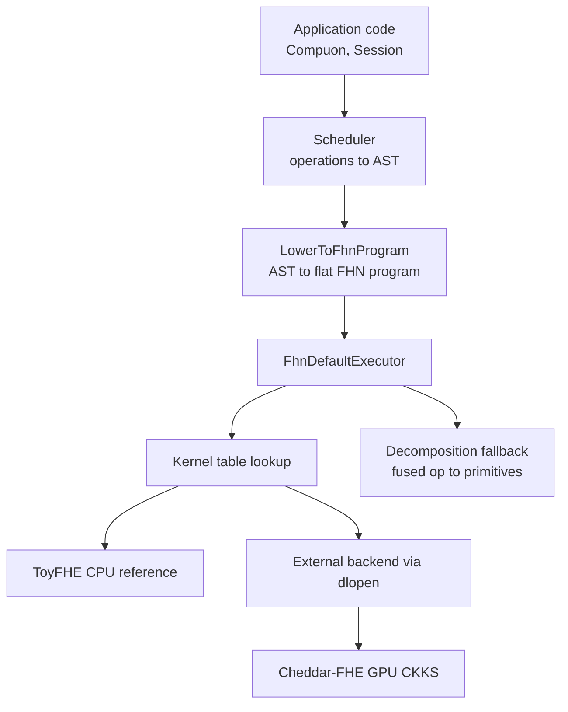

# FHENOMENON: A Catalyst for Enabling Practical Fully Homomorphic Encryption Programming Model

Fhenomenon is an early C++17 systems project for a practical, FHE-native programming model.

The core bet is simple: fully homomorphic encryption will not become practical by pretending that arbitrary software can be compiled unchanged into encrypted execution. It will also not become practical by making every backend maximally general and then accepting unusable speed. The useful boundary is closer to GPU computing. A trusted host should orchestrate public control flow, while an untrusted executor runs branchless, data-oblivious, coarse-grained encrypted kernels.

Fhenomenon treats constraints as performance contracts. A fast kernel that only works for a particular scheme, parameter set, packing layout, tensor shape, device residency, or application pattern is not a second-class hack. It is a valuable fast path, as long as its constraints are explicit enough for the runtime to dispatch, compose, benchmark, and replace it safely.

This repository is building the small runtime and backend interface for that world.

- A flat FHN program IR that is easy to generate, inspect, and execute.
- A C ABI kernel table that FHE library and hardware developers can extend without learning a complex compiler pipeline.
- A default executor that dispatches kernels and decomposes fused opcodes when a backend only exposes primitives.
- Optional async backend hooks for accelerator-oriented submission, polling, waiting, and output collection.
- A self-contained ToyFHE backend for CI, examples, and backend-author education.
- An external backend loader and an optional Cheddar-FHE GPU CKKS backend.

Fhenomenon is not production cryptography yet, and it is not a complete industrial platform. It is an engineering scaffold for finding the right offloading boundary between application code, encrypted kernels, and accelerator-aware orchestration.

For the design argument behind the project, see [Convergent Evolution: Why Secure Homomorphic Encryption Will Resemble High-Performance GPU Computing](https://ckks.org/test/2025-08-07-convergent-evolution/).

## Why This Exists

FHE is theoretically general, but practical secure execution is not shaped like normal software.

Secret-dependent branches, early exits, adaptive memory access, and pruning-heavy algorithms must either leak information or be converted into fixed, data-oblivious work. That usually means:

- both sides of a secret branch are evaluated;
- loops need public bounds;
- memory access patterns must be uniform or made oblivious at significant cost;
- performance comes from packing, batching, and fused kernels, not from skipping work.

So Fhenomenon does not start with "compile any program." It starts with a narrower and, we think, more realistic systems contract:

```text
Trusted host
  owns application control flow, public scheduling, keys, policies

FHN program
  a public, topologically sorted list of encrypted-kernel instructions

Secure kernel executor
  runs branchless FHE kernels through a backend-specific implementation
```

This makes Fhenomenon closer to a CUDA-like runtime boundary for FHE than to a universal source-to-FHE compiler.

The scalable object is the catalog, not a single universal kernel. In many FHE workloads, a generic implementation can be made more portable only by giving up the speed that would make adoption plausible. Fhenomenon therefore favors a growing catalog of narrow, fast kernels with explicit constraints, plus an executor that can choose the largest valid fast path, decompose when needed, and eventually overlap accelerator work through async submission and polling.

## Current Status

The repository already contains the first version of that boundary.

| Area | Status |
| --- | --- |
| FHN IR | Implemented in `include/FHN/fhn_program.h` as a flat C ABI instruction array. |
| Backend ABI | Implemented in `include/FHN/fhn_backend_api.h` with `fhn_get_info`, `fhn_create`, `fhn_destroy`, and `fhn_get_kernels`. |
| Default executor | Implemented in `FhnDefaultExecutor`; dispatches kernel-table entries and decomposes fused operations such as `FHN_HMULT`. |
| ToyFHE backend | Implemented as a CPU reference backend. Useful for tests and examples, not secure. |
| External backend loading | Implemented with `dlopen` for Linux/macOS style shared libraries. |
| Cheddar-FHE backend | Optional GPU CKKS backend under `src/FHN/cheddar`, built only when the Cheddar submodule and CUDA-facing dependencies are available. |
| Async backend hooks | `fhn_submit`, `fhn_poll`, `fhn_wait`, `fhn_get_outputs`, and `fhn_exec_free` are defined as optional exports and resolved by `ExternalBackend`; the default executor is still primarily synchronous. |
| Scheduler lowering | `LowerToFhnProgram` lowers scheduler ASTs into FHN programs. The legacy session execution path still coexists with this newer path. |
| TFHE-rs experiment | A separate Rust FFI experiment exists for integer operations when `BUILTIN_BACKEND=TFHE`. |

The current default developer path is ToyFHE plus unit tests. The Cheddar backend is the GPU-oriented CKKS target currently wired into this repository; the ABI is meant to host other accelerator backends and fast-path kernel catalogs as they become available.

The current ABI is intentionally modest. It can load a backend, inspect its kernel table, and call uniform kernel functions. The next important design step is to make kernel constraints, estimated cost, device residency, batching behavior, and async execution state visible enough for an executor to schedule real accelerator work instead of merely dispatching opcodes in order.

## Architecture


```mermaid
flowchart TD
    A["Application code<br/>Compuon<int>, Session"] --> B["Scheduler<br/>operations to AST"]
    B --> C["LowerToFhnProgram<br/>AST to flat FHN program"]
    C --> D["FhnDefaultExecutor"]
    D --> E["Kernel table lookup"]
    E --> F["ToyFHE CPU reference"]
    E --> G["External backend via dlopen"]
    G --> H["Cheddar-FHE GPU CKKS"]
    D --> I["Decomposition fallback<br/>fused op to primitives"]
```

### FHN Program

An `FhnProgram` is intentionally small:

- topologically sorted instructions;
- SSA-like `result_id` values;
- up to four operands per instruction;
- integer and floating parameters for opcode-specific metadata;
- explicit input and output id arrays.

Backends do not parse arbitrary C++ ASTs, compiler IR modules, or graph objects. They receive a public instruction stream and buffers.

That simplicity is a design principle. Fhenomenon should let cryptographers, FHE library authors, and hardware engineers contribute useful kernels without becoming compiler-pipeline engineers. A backend author should be able to say: "I can implement this operation at this granularity," register it in the table, test it, benchmark it, and move on to the next kernel.

This is patient catalog-building work. Practical FHE will need many kernels at many granularities: primitive arithmetic, scalar helpers, rotations, rescale/relinearize steps, fused multiply-add patterns, reductions, matrix tiles, convolutions, scans, and domain-specific kernels. FHN is designed so those kernels can be added one by one.

### Backend Kernel Table

A backend exports a compact C ABI:

```c
FhnBackendInfo *fhn_get_info(void);
FhnBackendCtx  *fhn_create(const char *config_json);
void            fhn_destroy(FhnBackendCtx *ctx);
FhnKernelTable *fhn_get_kernels(FhnBackendCtx *ctx);
```

Every kernel has the same function shape:

```c
typedef int (*FhnKernelFn)(FhnBackendCtx *ctx,
                           FhnBuffer *result,
                           const FhnBuffer *const *operands,
                           const int64_t *params,
                           const double *fparams);
```

That uniformity is deliberate. An FHE library developer should be able to expose `add`, `hmult`, `rotate`, `rescale`, or a domain-specific fused kernel by filling a table, not by learning the internals of Fhenomenon's scheduler.

The table is also allowed to be incomplete. Missing entries are not a failure of the backend model; they are how a backend grows. If a coarse kernel exists and its constraints match the workload, Fhenomenon should call it directly. If it does not, the default executor can fall back to smaller primitives where decomposition is defined. Over time, backends improve by replacing decomposed paths with native kernels.

The current `FhnKernelEntry` only records an opcode, function pointer, and debug name. That is enough for the first executor, but not enough for the long-term model. A production-grade kernel catalog should also expose:

- scheme and parameter-set constraints;
- packing, layout, shape, and level/scale assumptions;
- required rotation keys and other key material;
- host/device residency expectations;
- latency, throughput, transfer, and memory estimates;
- batchability and fusion boundaries;
- synchronous or async execution semantics;
- fallback and conformance-test requirements.

This is the difference between a generic primitive library and an FHE-native execution substrate. Fhenomenon should make narrow fast paths visible to the runtime instead of hiding them behind a slow lowest-common-denominator interface.

### Fused Operations

The opcode catalog includes both primitive and fused operations:

- primitive arithmetic: `FHN_ADD_CC`, `FHN_MULT_CC`, `FHN_ADD_CS`, `FHN_MULT_CS`;
- management operations: `FHN_RELINEARIZE`, `FHN_RESCALE`, `FHN_ROTATE`, `FHN_LEVEL_DOWN`;
- fused operations: `FHN_HMULT`, `FHN_HROT`, `FHN_HROT_ADD`, `FHN_HCONJ_ADD`, `FHN_MAD`;
- boolean/comparison slots for TFHE-style schemes.

If a backend supports a fused opcode, Fhenomenon dispatches it directly. If it only supports primitives, the default executor can decompose selected fused operations.

This is the central ecosystem idea: coarse kernels should be first-class, but backends can arrive gradually.

## Programming Philosophy

Fhenomenon is not trying to make arbitrary programs feel homomorphic. It is trying to make FHE-native programs feel natural.

That means the programming model should push developers to reinterpret a problem before they write code:

- split a task into smaller encrypted kernels with public boundaries;
- make independent subproblems explicit so they can be packed, batched, fused, or scheduled separately;
- treat secret-dependent branching as a design smell, not as a compiler feature to rely on;
- prefer fixed-shape dataflow over adaptive control flow;
- expose the shape of the computation early enough for a backend to choose the right kernel.

The goal is a habit shift similar to GPU programming. Good GPU programmers do not ask for a CPU program to be translated instruction by instruction. They restructure the problem around parallel work, memory movement, kernel launch overhead, and device-specific primitives.

FHE needs the same kind of discipline, with a stricter security model. The useful abstraction is not "write ordinary code and encrypt it later." It is "describe public orchestration around encrypted, data-oblivious kernels."

Fhenomenon should therefore make the right thing easy and the misleading thing uncomfortable. If a program depends on secret control flow, the system should surface that cost or reject the shape. If a computation can be expressed as independent tiles, reductions, rotations, scans, or fused arithmetic kernels, the system should make that structure obvious and rewarding.

The backend model follows the same philosophy. The project should not ask cryptography experts to reason about a deep compiler stack before they can contribute performance. It should ask them to contribute concrete kernels, in the granularity their scheme or hardware naturally supports, and let the FHN program/executor layer compose those kernels into larger encrypted workflows.

That granularity may be narrow. A GPU kernel that is extremely fast only for a fixed layout, a fixed tile size, a fixed CKKS level budget, or a known application pattern can still be the right industrial asset. In ordinary software engineering, narrowness often looks like a limitation. In FHE, narrowness is often the price of usable speed. The runtime should not pretend those constraints disappear; it should expose them, route around them, and overlap compatible work across accelerators when possible.

This does not make high-level freedom unimportant. It makes it a long-horizon goal that has to be earned from the bottom up. The eventual dream is an FHE software stack where richer frontends can build TensorFlow-like end-to-end computation graphs over encrypted data. Fhenomenon starts lower in the stack because that future needs a dependable kernel vocabulary, packing discipline, backend ABI, and execution model first.

## Quick Start

Fhenomenon currently targets Linux and macOS most directly. Windows support needs work because the external backend path uses `dlopen`.

Prerequisites:

- CMake 3.19 or newer
- A C++17 compiler
- Ninja recommended
- Git submodules are optional for the default ToyFHE path

Build and test:

```bash
cmake -S . -B build -G Ninja -DCMAKE_BUILD_TYPE=Debug
cmake --build build
ctest --test-dir build --output-on-failure
```

Run examples:

```bash
./build/bin/compuon-basic
./build/bin/session-basic
```

The default build uses the ToyFHE backend. It is intentionally small and insecure. Its purpose is to make the architecture runnable from a fresh clone.

## Minimal User-Side Shape

The current public C++ surface is still experimental, but the intended shape is:

```cpp
#include "Fhenomenon.h"

#include "Parameter/ParameterGen.h"
#include "Profile.h"

using namespace fhenomenon;

int main() {
  auto param = ParameterGen::createCKKSParam(CKKSParamPreset::FGb);
  auto profile = Profile::createProfile(param);

  Compuon<int> a = 10;
  a.belong(profile);

  Compuon<int> b = 20;
  b.belong(profile);

  auto c = a + b;
  auto d = c * a;

  return d.decrypt();
}
```

Today, `Compuon<int>` is the most exercised path. ToyFHE also contains fixed-point internals, and the codebase has experiments for other types and TFHE-rs, but broad type support should be treated as roadmap rather than stable API.

## Backend Author Sketch

To add a backend:

1. Include `FHN/fhn_backend_api.h`.
2. Define your opaque `FhnBackendCtx` and `FhnBuffer`.
3. Wrap your library's operations in uniform `FhnKernelFn` functions.
4. Fill a `FhnKernelEntry` array.
5. Export the four required `fhn_*` functions.

Example kernel table shape:

```c
static FhnKernelEntry kernels[] = {
  {FHN_ADD_CC, add_cc, "add_cc"},
  {FHN_HMULT, hmult, "hmult"},
  {FHN_ROTATE, rotate, "rotate"},
  {FHN_RESCALE, rescale, "rescale"},
};

FhnKernelTable *fhn_get_kernels(FhnBackendCtx *) {
  static FhnKernelTable table = {
    sizeof(kernels) / sizeof(kernels[0]),
    kernels,
  };
  return &table;
}
```

The full ToyFHE implementation in `src/FHN/ToyFheKernels.cpp` is the reference template. The Cheddar backend in `src/FHN/cheddar/CheddarFhnBackend.cpp` shows the same pattern against a GPU CKKS library.

## What We Need Help With

Fhenomenon is small enough that a contributor can still shape the core model. Useful contributions include:

- implementing new FHN opcodes and decomposition rules;
- designing metadata for kernel constraints, cost, residency, and async execution;
- making the FHN buffer ABI less backend-specific;
- wiring `Session` execution fully through the FHN path;
- improving `LowerToFhnProgram` coverage beyond add/multiply;
- designing frontend APIs that force public kernel boundaries instead of hiding encrypted control flow;
- writing examples that teach decomposition into independent encrypted subproblems;
- adding backend kernels at multiple granularities, from tiny primitives to narrow application-specific fast paths;
- documenting the cost and replacement path when a fused operation currently decomposes into smaller kernels;
- building real fused kernels for matrix multiplication, convolution, rotations, and reductions;
- adding benchmark suites that measure constraints, data movement, device residency, async overlap, and kernel fusion, not just primitive op latency;
- improving the Cheddar-FHE backend and documenting its configuration;
- adding Windows dynamic-library support;
- writing design notes for the trusted-host to secure-executor security boundary;

## Roadmap

Near term:

- stabilize the FHN C ABI and buffer ownership rules;
- finish the scheduler-to-FHN execution path;
- document backend authoring with ToyFHE and Cheddar side by side;
- make scalar, rotation, and fused-kernel tests more systematic.
- document which constraints are already implicit in each kernel and which should become explicit ABI metadata.

Mid term:

- define a small benchmark vocabulary around kernel residency, transfer cost, and fusion wins;
- add constraint metadata to the kernel table without making backend authors implement a compiler;
- turn the optional async backend exports into an executor path that can submit, poll, wait, collect outputs, and overlap independent work;
- add richer lowering for scalar operands, rotations, and packed vectors;
- formalize when host scheduling is public and safe;
- make Cheddar-FHE a compelling GPU backend demo.

Long term:

- grow a catalog of FHE-native kernels that are useful before a universal compiler exists, including fast narrow kernels for real application constraints;
- allow compilers, DSLs, and handwritten frontends to target FHN;
- make it possible to build TensorFlow-like ML graph pipelines on top of FHN once the lower-level kernel, constraint, and scheduling substrate is strong enough;
- make Fhenomenon a shared systems layer for FHE libraries, hardware prototypes, and application experiments.

## What Moved Out Of The README

Older versions of this README described several ideas that are not current implementation commitments: automatic scheme switching through repeated `belong()` calls, POD struct to SIMD slot mapping, broad transparent support for CKKS/BGV/BFV/TFHE, a full key-management subsystem, and a general hardware abstraction layer.

Those ideas are preserved in [docs/vision-archive.md](docs/vision-archive.md). They are not treated as abandoned; most are long-horizon capabilities that should re-enter the project only when the lower-level FHN model can support them honestly.

## License

Fhenomenon is licensed under the terms in [LICENSE](LICENSE).
